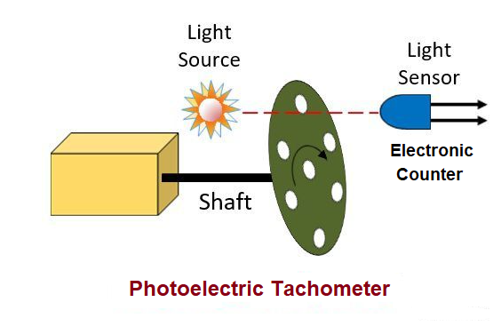

## Photoelectric Tachometer
### Introduction :

The tachometer which uses the light for measuring the speed of rotation of shaft or disc of machines is known as the photoelectric tachometer. The opaque disc with holes on its periphery, light source and laser are the essential parts of the photoelectric tachometer.The tachometer consists the opaque disc which is mounted on the shaft whose speed needs to be measured. The disc consists the equivalent holes around the periphery. The light source is placed on one side of the disc and the light sensor on the other side. They are in line with each other.When the opaque portion comes in the line of light source and sensor, then the disc blocked the light source, and the output becomes zero. The production of pulses depends on the following factor.

- The number of holes on the disc.
- The speed of rotation of the disc.

The holes are fixed, and hence the pulse generation depends on the speed of the rotation of the disc. The electronic counter is used for measuring the pulse rate.

When the disc rotates their holes, and the opaque portion comes alternatively between the light source and light sensor. When the holes come in the line of the light source and the light sensor, then the light passes through the holes and collapse to the sensor. Hence the pulse is generated. These pulses are measured through the electric counter.

### Theory Analysis and Simulation

#### Working Principle

This method of measuring speed of rotation consists of mounting an opaque disc on the rotating shaft as is shown in Fig.

The disc has a number of equidistant holes on its periphery. At one side of the disc a light source is fixed and at the other side of the disc, and on line with the light source, a light sensor such as a photo tube or some photosensitive semi-conducting device is placed. When the opaque portion of the disc is between the light source and the light sensor, the latter is unilluminated and produces no output. But when a hole appears between the two, the light falling upon the sensor produces an output pulse.
The frequency at which these pulses are produced depends upon the number of holes in the disc and its speed of rotation. Since the number of holes is fixed,the pulse rate is a function of speed of rotation. The pulse rate can be measured by an electronic counter pich can be directly calibrated in terms of speed in rpm.

PULSES = SPEED * NUMBER OF HOLES

#### Advantages :

This system has two distinct advantages:

(i) The output format is digital and this means that if the tachometer is a part of a digital instrumentation system, no analog to digital conversion is necessary.

(ii) The pulse amplitudes are constant. This simplifies the electronic circuitry.

#### Disadvantages:

i) A disadvantage is that the light source must be replaced from time to time. A typical life time for light source is 50,000 hours.

(ii) The accuracy of this method depends principally on the error represented by one pulse. The digital meters measure frequency by counting the number of input pulses which occur in short period of time called gating period. If this period is too small serious errors maybe caused. The gating period should therefore, be chosen to give a suffi- ciently large count. In general, all the digits on the digital display should be utilized.

The factors which the user can control to minimise the errors are :
(i) gating period, and
(ii) number of pulses generated per revolution.